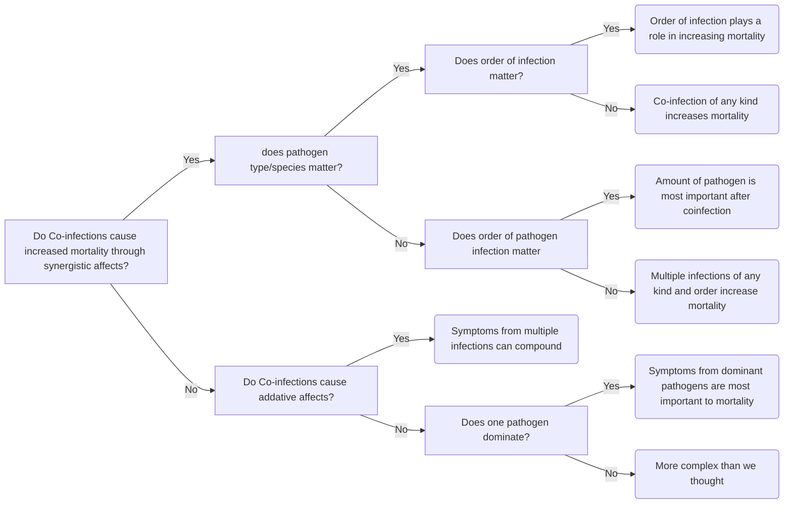

# Bumble Bee Co-Infection Flow Chart 

### Homework 3

P. Alexander Burnham

February 1, 2017

```mermaid

graph LR
A[Do Co-infections cause increased mortality through synergistic affects?]
    A-->|Yes| C[does pathogen type/species matter?]
    A-->|No| D[Do Co-infections cause addative affects?]
    D-->|Yes| E(Symptoms from multiple infections can compound)
    D-->|No| F[Does one pathogen dominate?]
    C-->|Yes| G[Does order of infection matter?]
    C-->|No| H[Does order of pathogen infection matter]
    F-->|Yes| K(Symptoms from dominant pathogens are most important to mortality)
    F-->|No| L(More complex than we thought)
    G-->|Yes| M(Order of infection plays a role in increasing mortality)
    G-->|No| N(Co-infection of any kind increases mortality)
    H-->|Yes| O(Amount of pathogen is most important after coinfection)
    H-->|No| P(Multiple infections of any kind and order increase mortality)
    
```

