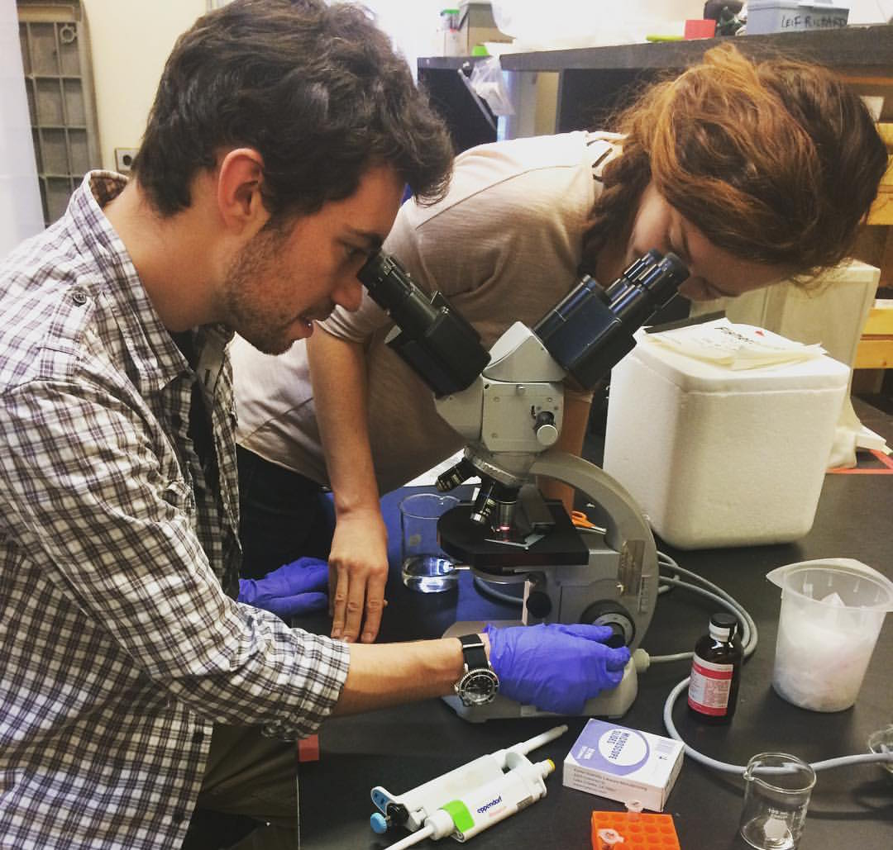

 

### Homework Assignments:

* [Assignment 1 (Beamer Presentation PDF)](Presentation/VT_vs_CA_Pathogens.pdf)
* [Assignment 1 (Beamer Presentation RMD)](Presentation/VT_vs_CA_Pathogens.Rmd)
* [Assignment 2 (Thinking on Paper)](Assignment2_Bio381.html) 
* [Assignment 3 (Flow Chart)](BurnhamFlowChart.html)  
* [Assignment 4 (MetaData and Regular Exp.)](Homework4.html)
* [Assignment 5 (Working on Problems in R)](Burnham_HW_2_15Feb2017.html)
* [Assignment 6  (Creating a help sheet for 13 functions)](Homework6.html)
* Assignment 7  (added functions from last week that other people didn't get to)
* [Assignment 8  (Created Functions for Stat. Anlaysis)](Homework8.html)
* [Assignment 9 (created functions for repeated measures ANOVA and fake data)](Homework9.html)
* [Assignment 10 (for loops (see chunk 3 for one-line nested for loop!))](Homework10.html)

### Presentations and Notes:

* [LECTURE NOTES](ComBioNotes.html)    
* [ggplot2 Presentation](ggplot2pres.html)    
* [VT vs CA Honeybee Presentation](Presentation/VT_vs_CA_PathogensShort.pdf)    

